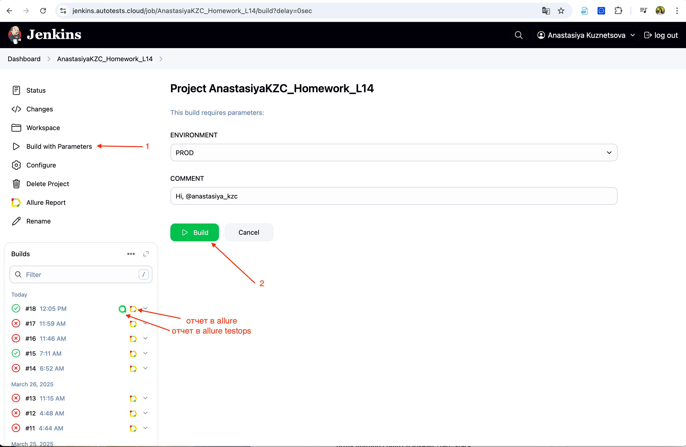
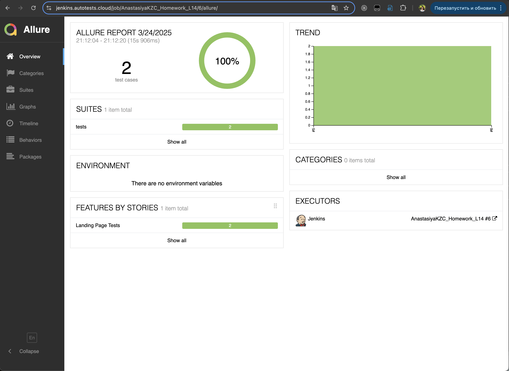
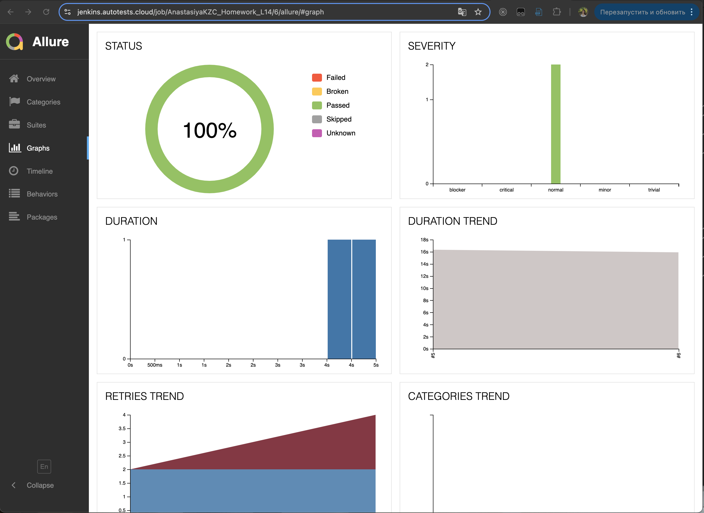
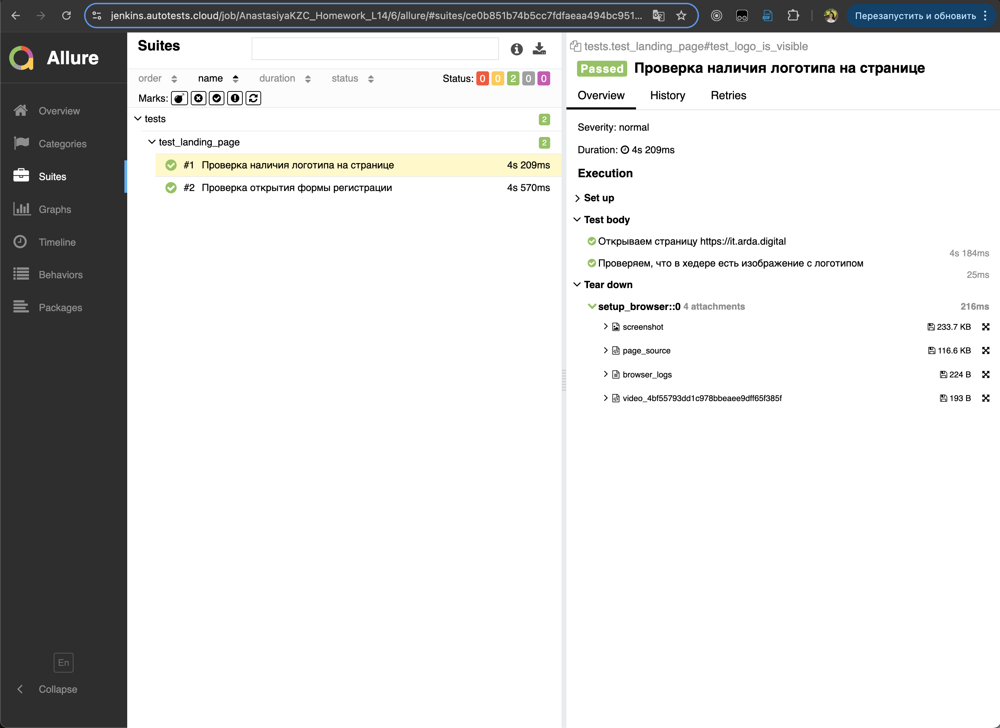
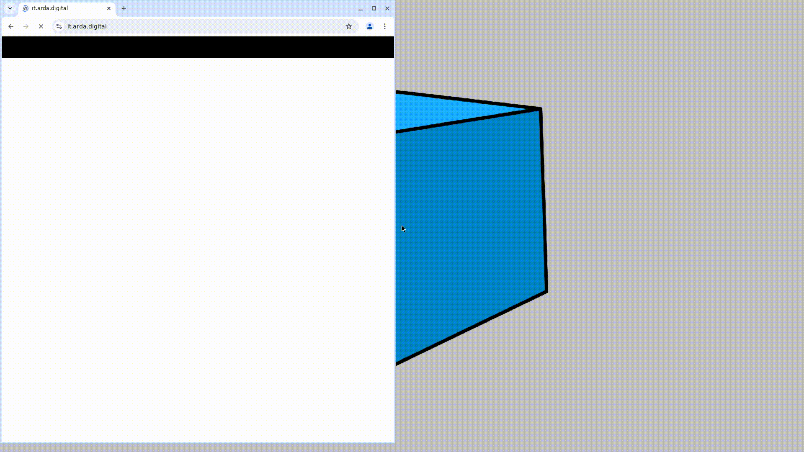
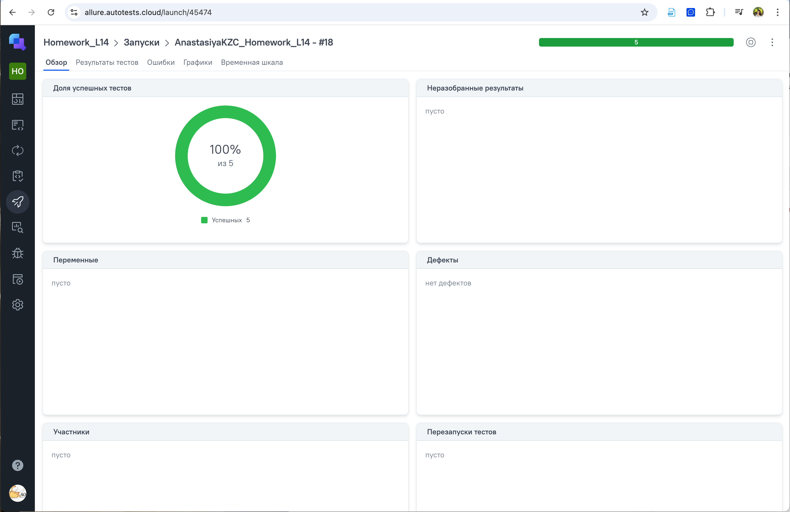
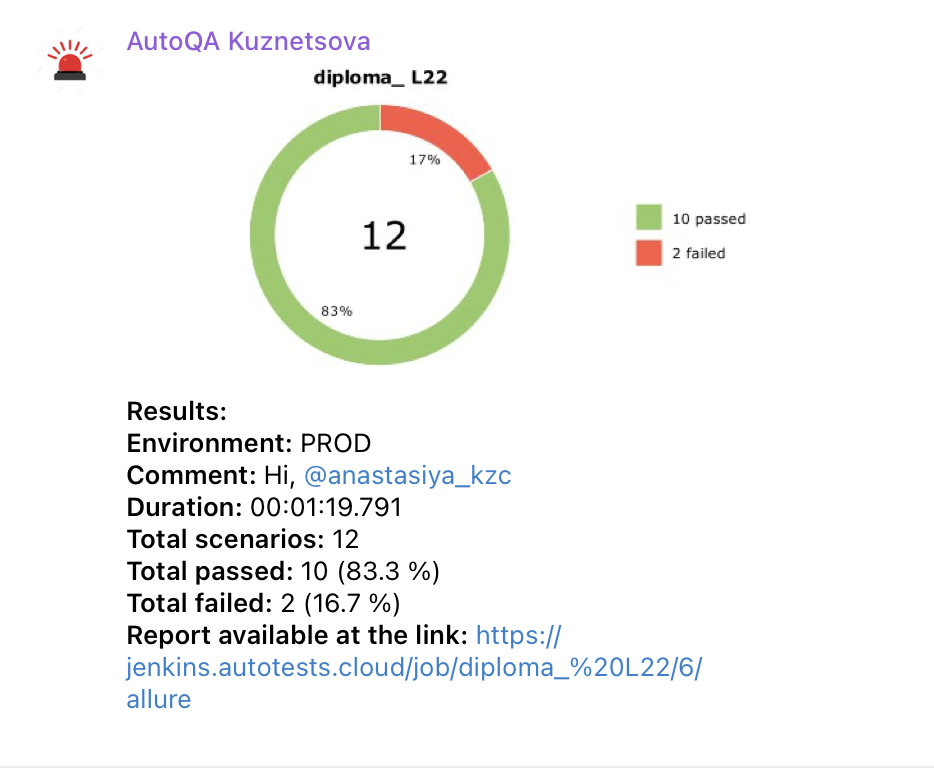

## Homework_L22 Дипломный проект UI+API

- [Ссылка на занятие](https://school.qa.guru/pl/teach/control/lesson/view?id=334954986&editMode=0) 
- [Инструкция по проверке диплома](https://rainbow-spleen-3c9.notion.site/QA-GURU-PYTHON-ff276648b76a4e6b8bb538051ddf6fb4)


# Проект тестирования "it.arda.digital" UI+API 
> <a target="_blank" href="https://it.arda.digital/">Ссылка на страницу ИТ-кластера</a>
<p align="center">
  
</p>


## Проект реализован с использованием 
<p align="left">
   
  
  
  
  
  
  
  
  
  
</p>

## Список проверок, реализованных в автотестах
### UI
- [x] Лендинг. Открытие страницы - наличие логотипа
- [x] Лендинг. Открытие страницы - открытие формы регистрации
- [x] Лендинг. Переход на https://arda.digital/
- [x] Авторизация. Отправка пустой формы
- [x] Авторизация. Неверный логин
- [x] Авторизация. Неверный пароль
- [x] Авторизация. Успешная авторизация 

### API
- [x] 


## Установка
```sh
pip install -r requirements.txt  # Установка зависимостей
```

## Запуск тестов
```sh
pytest tests/ # Запуск всех тестов в проекте
```

```sh
pytest -v tests/  # Запуск всех тестов с детальным логом
```

```sh
pytest --alluredir=allure-results  # Запуск с сохранением отчёта Allure
```


### Основные ключи `pytest`:
- `-v` (verbose) — подробный вывод результатов тестирования.
- `-s` (show output) — показывает `print` внутри тестов.
- `--maxfail=N` — завершает тестирование после `N` неудачных тестов.
- `-k 'substring'` — запускает только тесты, содержащие `substring` в названии.
- `--tb=short` — сокращенный вывод трейсбека ошибок.
- `allure serve tests/allure-results` — запускает локальный сервер с отчетом Allure.

##  Запуск проекта в Jenkins
[Job](https://jenkins.autotests.cloud/job/AnastasiyaKZC_Homework_L14/)

При нажатии на "Build with Parameters", а затем "Build" начнется сборка тестов и их прохождение через виртуальную машину в Selenide.


##  Allure report
После прохождения тестов, результаты можно посмотреть в Allure отчете, где также содержится ссылка на Jenkins.


Во вкладке Graphs можно посмотреть графики о прохождении тестов, по их приоритизации, по времени прохождения и др.


Во вкладке Suites находятся собранные тест-кейсы, у которых описаны шаги и приложены логи, скриншот и видео о прохождении теста.


Видео прохождения теста:


##  Интеграция с Allure TestOps
[Dashboard](https://allure.autotests.cloud/launch/45474)

Так же вся отчетность сохраняется в Allure TestOps, где строятся аналогичные графики.


Во вкладке со сьютами, мы можем:
- Управлять всеми тест-кейсами или с каждым отдельно
- Перезапускать каждый тест отдельно от всех тестов
- Настроить интеграцию с Jira
- Добавлять ручные тесты и т.д.


##  Интеграция с Telegram
После прохождения тестов, в Telegram bot приходит сообщение с графиком и небольшой информацией о тестовом прогоне.

